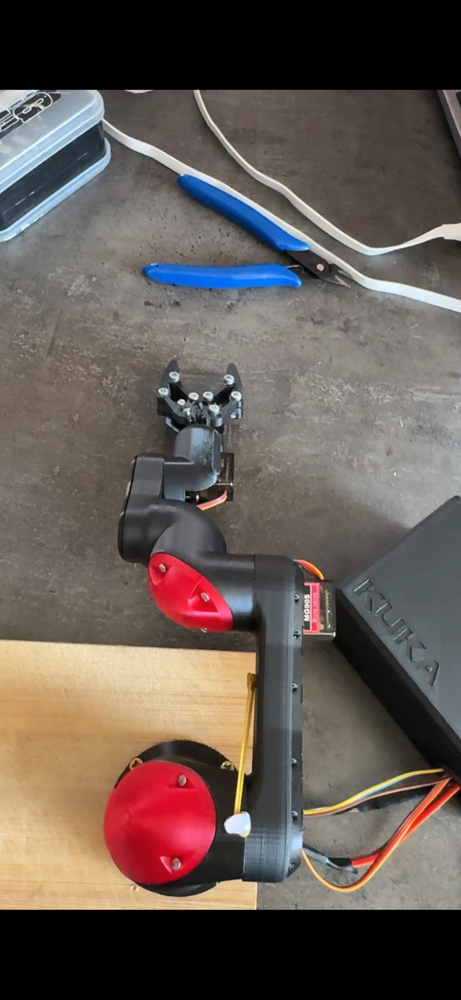

# 4-DOF Robotic Arm (ESP32 + PCA9685)

A desktop robotic arm — ESP32 driving 5 servos through a PCA9685 PWM controller (base, shoulder, elbow, wrist, gripper).

## Attribution

**The mechanical design (3D-printed arm and gripper) is not my work.** It's based on the open-source models by **andrem4c** on Cults3D:

- Arm: [4dof-robotic-arm-cobot-kuka-based](https://cults3d.com/en/3d-model/gadget/4dof-robotic-arm-cobot-kuka-based)
- Controller box: [controller-box-for-robotic-arm-stl-files-and-pcb-files](https://cults3d.com/en/3d-model/gadget/controller-box-for-robotic-arm-stl-files-and-pcb-files)

Go to those listings for the STL files and their license terms — they aren't redistributed in this repo.

**My contribution is limited to:**
- ESP32 firmware implementation
- PCA9685 servo control
- Mechanical calibration
- Hardware adaptation (wiring, power delivery)
- Servo range calibration

## How it works

The ESP32 talks to a PCA9685 16-channel PWM driver over I2C, which in turn drives 5 servos — one per joint plus the gripper. The firmware currently runs a pre-programmed demo motion sequence (smooth moves through base/shoulder/elbow/wrist/gripper positions), rather than live interactive control.

## Bill of materials

### Electronics

| Qty | Component |
|---|---|
| 1 | ESP32 DevKit V1 (ESP-WROOM-32) |
| 1 | PCA9685 servo driver (16-channel, I2C) |
| 1 | 3.3V ↔ 5V bidirectional logic level shifter |
| 5 | MG996R servos (or equivalent high-torque servo) |
| 1 | 5V power supply, 5A minimum (6A recommended for stable operation) |
| 1 | USB cable for ESP32 |
| — | Dupont wires (M-M and M-F) |
| — | Power connectors, as needed |

### Mechanical

| Qty | Component |
|---|---|
| 1 | 3D-printed arm (base, shoulder, elbow, wrist, gripper mount) — see [Attribution](#attribution) |
| 1 | 3D-printed mechanical gripper — see [Attribution](#attribution) |
| — | M3 screws (assorted lengths) |
| — | M3 nuts |
| — | M3 spacers |
| — | Servo horn mounting screws |

### Print materials

- Black PLA filament
- Red PLA filament

### Power

- 5V / 5–6A power supply
- 5.5 × 2.1 mm DC barrel cable

### Software

- [Arduino IDE](https://www.arduino.cc/en/software)
- ESP32 board package
- `Wire` library (bundled with Arduino core)
- [Adafruit PWM Servo Driver Library](https://github.com/adafruit/Adafruit-PWM-Servo-Driver-Library)
- USB driver for the ESP32's onboard USB-serial chip (CH340 or CP2102, depending on your board)

## Wiring

### ESP32 ↔ PCA9685 (I2C)

| ESP32 | PCA9685 |
|---|---|
| GPIO21 | SDA |
| GPIO22 | SCL |
| GND | GND |
| 3.3V | VCC |

### Servo power

- Power supply 5V → PCA9685 `V+`
- Power supply GND → PCA9685 GND
- ESP32 GND → PCA9685 GND (common ground)

### Servo channel mapping

| PCA9685 channel | Joint |
|---|---|
| CH0 | Base |
| CH1 | Shoulder |
| CH2 | Elbow |
| CH3 | Wrist |
| CH4 | Gripper |

## Firmware

[`firmware/RobotGripper.ino`](firmware/RobotGripper.ino) initializes the PCA9685 at 50 Hz, moves all joints to a safe starting position, then loops through a smooth demo sequence exercising the base rotation, shoulder, elbow, wrist, and gripper open/close, before returning to a safe pose.

Flash it with the Arduino IDE (ESP32 board package + Adafruit PWM Servo Driver Library installed).
